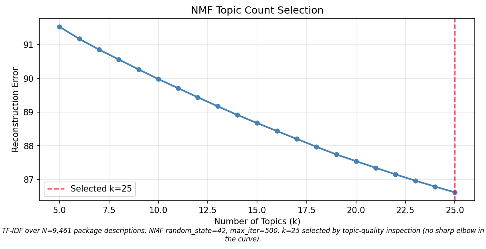
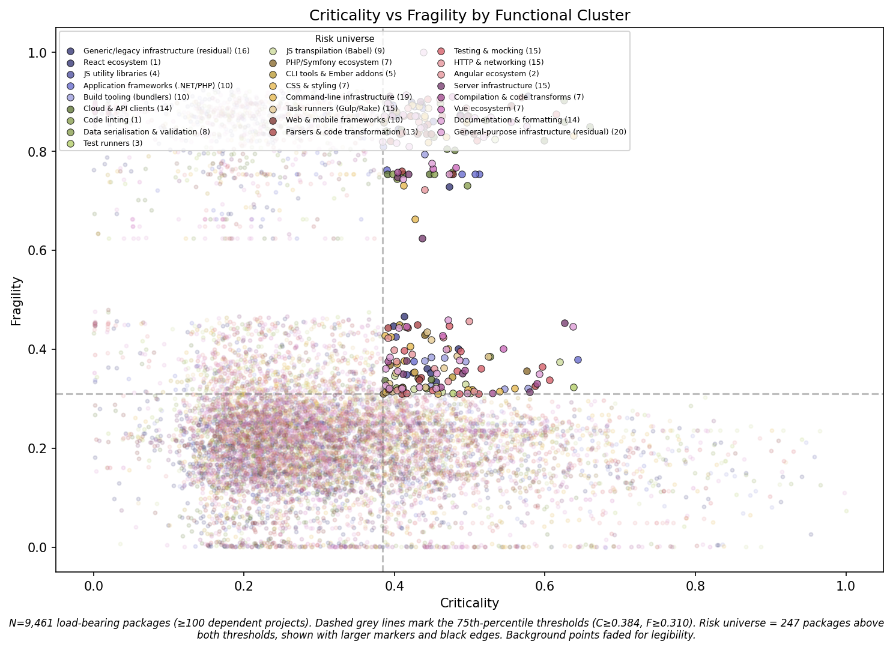
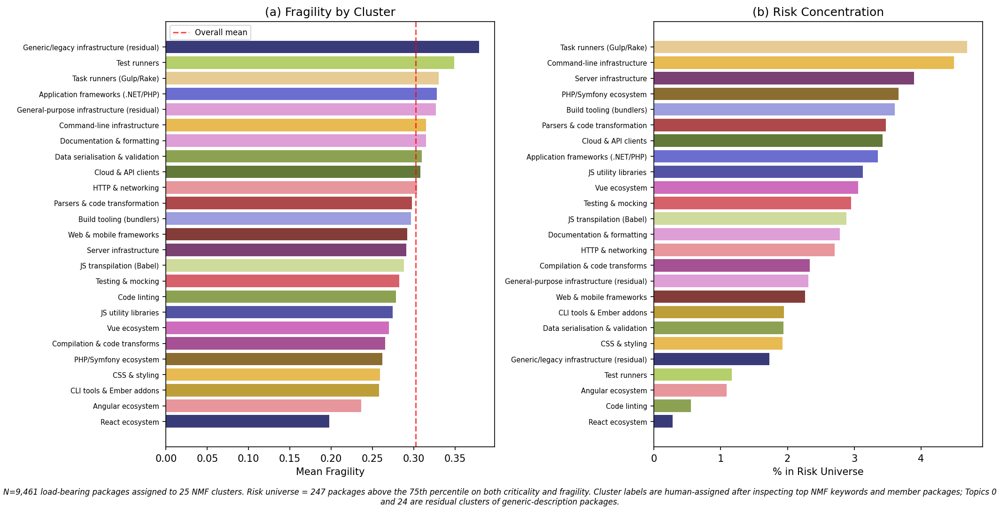
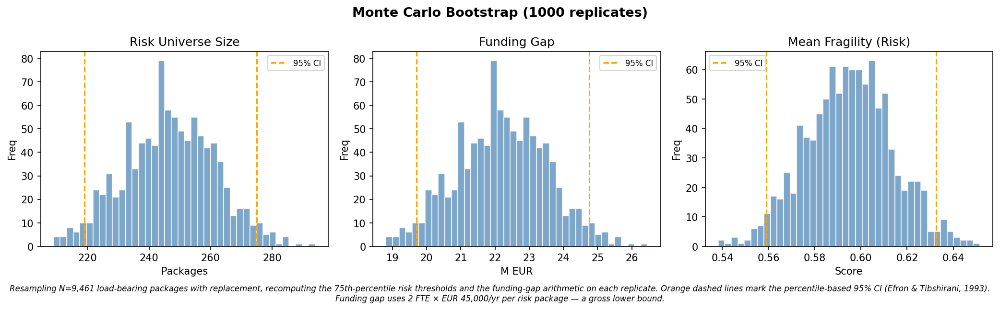

## 1. Introduction and research question

The European software sector — Eurostat NACE J62/J63 — produced EUR 467 billion in gross value added in 2022. A large share of that value rests on a substrate of open source software (OSS) packages that are downloaded, depended on, and shipped into production by firms that contribute little or nothing to their maintenance. The Apache Log4j incident of December 2021 made the consequences visible: a single-maintainer Java logging library, embedded in commercial products worldwide, propagated a remote-code-execution vulnerability into critical infrastructure within days. The maintainer had been working on the project unpaid in his free time.

The standard framing of this problem is a Samuelsonian public goods story: OSS is non-rival and non-excludable, so the market under-provides it. That framing has the wrong empirical content. Much of critical OSS is *not* under-provided: popular packages attract maintainers and contributor communities that grow with downstream use. That attention is often guided by corporate self-interest and not preventative work. The problem is not uniform. A sharper framing comes from Ostrom (1990): OSS infrastructure is a common-pool resource, governed in practice by community institutions whose success depends on identifiable design conditions. Where those conditions hold, self-organisation works; where they fail, packages become *critical-but-fragile* — load-bearing, but maintained by one or two unpaid people with no institutional awareness or attention (Schweik & English, 2012). The question is then not *whether* OSS is under-provided but *where* governance fails and how much economic value sits above those failures.

This paper asks: **Which functional categories of load-bearing open source infrastructure are most fragile, and what is the order of magnitude of the unmet maintenance funding need above them?** The contribution is methodological rather than substantive. It combines composite criticality and fragility scoring on a 4.6-million-package dependency graph with NMF topic modelling of package descriptions, percentile-based risk-universe identification, and a Monte Carlo bootstrap for inference. The aim is a defensible per-cluster funding-gap minimum value estimate for the EU software sector that policymakers can use to size a targeted backstop, not a precise euro figure.

## 2. Data and processing

**Libraries.io v1.6.0** (Katz, 2020), retrieved from Zenodo, is a snapshot taken on 12 January 2020 covering 4.6 million packages across 36 package managers. For each package the dataset reports name, ecosystem, description, dependent-project and dependent-repository counts, contributor and star counts, open-issue counts, and timestamps for the latest release and last repository push. Analysis is restricted to seven major ecosystems — npm, Maven, PyPI, NuGet, RubyGems, Packagist, Cargo — producing 2.4 million candidate packages, of which 9,461 meet a *load-bearing* threshold of at least 100 dependent projects. This threshold is conservative; it identifies packages whose failure would propagate to a non-trivial number of downstream consumers.

**Eurostat National Accounts** (`nama_10_a64`, B1G — Gross Value Added at current prices, NACE J62_J63 — Computer programming, consultancy, data processing) provides the economic context: EUR 466,568 million across 31 countries in 2022. The series is fetched once via DBnomics and cached locally. EU aggregates (EU27, EA19, etc.) are excluded to avoid double-counting member states.

**Processing and reproducibility.** A separate `preprocess.py` script handles the cleaning. Two operational fixes are documented in `PROJECT_OVERVIEW.md`: an off-by-one CSV header correction, and imputation of missing contributor counts (28% of load-bearing packages) as 1, treating missingness as evidence of under-resourcing rather than dropping a quarter of the sample. Days since release are imputed at the 90th percentile when both release and push timestamps are missing.

The preprocessing step writes a 1.9 MB analysis-ready CSV (`data/packages_loadbearing.csv`) and a 31-row Eurostat cache. All subsequent analysis runs offline and deterministically against these files; the random seed (`42`) is propagated to the NMF, the LASSO cross-validation split, and the bootstrap RNG.

## 3. Methods

**Criticality.** A composite score in [0, 1] computed from Libraries.io dependent-project and dependent-repository counts:
$$C = \text{norm}\left(0.65 \cdot \text{norm}(\log(1+d_{pkg})) + 0.35 \cdot \text{norm}(\log(1+d_{repo}))\right)$$
where `norm` is min-max scaling. The log transform reflects the heavy-tailed distribution of dependent counts (a handful of packages have tens of thousands of dependents). The 65/35 weighting favours direct package dependencies over repository-level usage, which the Libraries.io documentation reports more conservatively.

**Fragility.** A weighted additive composite of four indicators:
$$F = \text{norm}\left(0.30 \cdot f_{contrib} + 0.30 \cdot f_{stale} + 0.20 \cdot f_{issues} + 0.20 \cdot f_{busfactor}\right)$$
where $f_{contrib} = 1/contributors$, $f_{stale} = \log(1 + \text{days since release})$, $f_{issues} = \text{open\_issues}/\max(stars, 1)$, and $f_{busfactor} = \mathbb{1}[contributors < 2]$, each min-max normalised. An additive form is used over a multiplicative one to avoid zero-inflation collapsing the score whenever any single component is zero.

**Risk universe.** Packages above the 75th percentile on *both* criticality and fragility. The 75th percentile is a conventional financial Value-at-Risk threshold. A sanity check confirms construct validity: `log4j:log4j` (the Log4Shell package) sits comfortably inside the risk universe at C = 0.625, F = 0.903.

**Topic modelling.** Package descriptions are vectorised with TF-IDF after URL stripping, markdown-image removal, and an 80-term domain stop-word list (artifact types, platform identifiers, marketing filler) added on top of sklearn's English stop words. Non-negative matrix factorisation (Lee & Seung, 1999) is preferred over LDA because package descriptions are typically a single sentence of technical jargon — too short for LDA's generative assumptions but well-suited to NMF's non-negative additive decomposition. The number of topics, $k = 25$, was selected by manual topic-quality inspection: no cluster exceeds 9.8% and topics resolve into recognisable functional categories (HTTP & networking, build tooling, CSS & styling, cloud & API clients, etc.). The reconstruction-error curve (Figure 1) has no sharp elbow, so the choice rests on interpretability.

{ width=70% }

Two of the 25 clusters (Topics 0 and 24) are *residual* — they collect packages with descriptions too generic for NMF to assign elsewhere.

**LASSO validation.** Cross-validated LASSO regression of the bus-factor flag on observable features provides directional validation of the fragility weights. The procedure is partially circular and is used as a sanity check only, not to set weights.

**Bootstrap inference.** 1,000 Monte Carlo replicates resample the 9,461 packages with replacement, recomputing the 75th-percentile thresholds and risk-universe size on each replicate. Confidence intervals are percentile-based (Efron & Tibshirani, 1993).

**Funding gap.** A gross lower bound: 2 FTEs per risk-universe package at the EU median software developer salary of EUR 45,000/year (EUR 90,000 per package per year). The 2-FTE floor is drawn from OpenSSF guidance on minimum viable maintenance staffing — one for active development, one for security response and bus-factor redundancy. The estimate is conservative on four dimensions (sub-market salary, uniform staffing, no offset for existing funding, conservative percentile threshold), all pushing in the same direction.

## 4. Results

**Risk universe.** Of 9,461 load-bearing packages, 247 (2.6%) lie above the 75th percentile on both criticality and fragility. The Pearson correlation between criticality and fragility is $r = -0.31$ ($p < 10^{-200}$, Spearman $\rho = -0.26$): more critical packages tend to be *less* fragile. This is the central empirical finding of the paper. The market, as represented in this case by the community-governance institutions Ostrom predicts, partly works: visible, widely-used packages attract maintainers. The 247 packages in the risk universe are the exceptions, the cases where governance has not self-organised despite high downstream usage.

Figure 2 shows the full distribution; the risk universe sits in the upper-right quadrant, coloured by functional cluster.

{ width=95% }

**Cluster ranking.** Table 1 reports the five most fragile clusters by mean fragility score; Figure 3 shows the full ranking alongside the share of each cluster in the risk universe.

| Cluster | $N$ | Mean F | % bus factor = 1 | $N$ in risk universe |
|---|---:|---:|---:|---:|
| Generic/legacy infrastructure (residual) | 927 | 0.379 | 26.9% | 16 |
| Test runners | 258 | 0.349 | 19.8% | 3 |
| Task runners (Gulp/Rake) | 320 | 0.330 | 12.5% | 15 |
| Application frameworks (.NET/PHP) | 298 | 0.328 | 21.8% | 10 |
| General-purpose infrastructure (residual) | 866 | 0.327 | 17.7% | 20 |

The two top-five entries are residual clusters; the remaining three are interpretable functional categories. The headline finding therefore needs care: the most fragile *labelled* cluster is Test runners, but the most fragile cluster overall is a residual whose risk-bearing members are predominantly legacy enterprise Java dependencies.

{ width=95% }

**Threshold sensitivity.** The risk universe size scales sharply with the chosen percentile threshold: 12 packages at the 90th percentile, 247 at the 75th, 1,146 at the 60th. The cluster with the *highest risk concentration* (share of cluster members in the risk universe) also varies: Command-line infrastructure at the 60th, Task runners (Gulp/Rake) at the 75th, Cloud & API clients at the 90th. There is no single "most at-risk category" that survives across thresholds. The mean-fragility ranking is more stable than the risk-concentration ranking but still depends on how residual clusters are treated.

**LASSO sanity check.** In 5-fold CV, LASSO achieves $R^2 = 0.24$ with `log(stars)` the strongest predictor (coef $-0.29$), consistent with the C–F correlation; staleness is zeroed out, suggesting the four fragility indicators are partially redundant.

**Funding gap.** At 2 FTEs × EUR 45,000 per risk-universe package, the gross lower-bound funding gap is **EUR 22.2 million per year [bootstrap 95% CI: 19.7, 24.8]**. The bootstrap CI characterises sampling uncertainty in the risk-universe size only — it does not quantify any of the four specification uncertainties (see Methods), all of which would push the figure upward. Per-cluster gaps range from EUR 0.1M (React, Code linting — single risk-universe packages) to EUR 1.4M (Generic/legacy, Task runners, Server infrastructure, HTTP & networking, Testing & mocking — clusters with 15+ risk-universe packages). Figure 4 shows the bootstrap distributions for the risk universe size, the funding gap, and the mean fragility of risk-universe packages.

{ width=95% }

The funding gap of EUR 22M sits against an EU software-sector GVA of EUR 467 billion. As a fraction of GVA the gap is 0.005% — economically negligible *if it could be paid*. For comparison, Germany's Sovereign Tech Fund disbursed ~EUR 11.5M in 2023 — the gross unmet need identified here is of the same order as existing European public funding for OSS.

## 5. Discussion

**Interpretation through the Ostrom frame.** The negative C–F correlation is the paper's most economically interesting result. It rules out the strong-form public-goods reading — "OSS is uniformly under-provided" — and supports a CPR reading — "OSS is variably governed; institutions emerge for visible packages and fail for the rest." The 247 packages in the risk universe are the cases where neither corporate sponsorship nor foundation grants nor community contribution have closed the maintenance gap, despite the package being load-bearing. The policy implication is *targeted backstop*, not wholesale state provision.

**Limitations.** Five are material. First, the fragility distribution is bimodal with an empty band between F $\approx$ 0.50 and F $\approx$ 0.60, a specification artifact of the binary bus-factor indicator (contributors < 2): single-maintainer packages receive simultaneous boosts on two score components, so every single-maintainer load-bearing package sits above the 75th-percentile fragility threshold. The risk universe is still filtered by criticality (about half its 247 members have 2+ contributors), but fragility ranking above the gap is driven almost entirely by the bus-factor flip — the operative phase transition for security-response capacity. Second, the Libraries.io snapshot is from January 2020; the OSS landscape has moved (npm growth, Rust adoption, the Log4Shell aftermath) and concrete package-level findings would need a fresh pull to be operationally actionable. Third, criticality is computed from Libraries.io dependent counts only — npm coverage is more complete than Maven or NuGet because enterprise Java/.NET deployments often use private artifact repositories. The risk universe is therefore npm-heavy (62%); a fully-symmetric analysis would require commercial registry data. Fourth, fragility is measured from package metadata rather than code or commit history. A package with weekly commits by a single maintainer is not "fragile" in the same sense as one with no activity for two years, but the score conflates them at the high end. Fifth, a post-hoc NMF on the 247 risk-universe descriptions decomposes the set into three genres — legacy Java infrastructure, Microsoft/.NET metapackage artifacts whose contributors=1 status is likely a Libraries.io metadata gap, and npm micro-utilities whose single-maintainer status is low-risk by construction. The substantive funding gap belongs almost entirely to the first genre; a refined pipeline would allocate non-uniformly across the three.

**Policy implications.** The 247 packages identified here are candidates for targeted public funding through institutions modelled on the Sovereign Tech Fund and NLnet — small grants, lightweight oversight, focused on filling the maintenance gap rather than directing development. The cluster-level breakdown shows where the gap concentrates: legacy enterprise infrastructure, task runners and build tooling, HTTP and networking, test runners and mocking. A formal cost-benefit analysis comparing the EUR 22M lower bound to the avoided cost of Log4Shell-class incidents would extend this work; it is left for follow-up because credible incident-cost data remains fragmentary.

---

**References.** Efron & Tibshirani (1993); Eghbal (2016); Katz (2020); Lee & Seung (1999); Nagle et al. (2022); Ostrom (1990); Schweik & English (2012). Full citations in `references.md`.

**Reproducibility.** All results, tables, and figures are produced by `preprocess.py` followed by `analysis.py` against the inputs documented in `raw_data/README.md`. Random seed = 42 throughout. See `README.md` for run instructions. 

**Full repository.**  `<https://github.com/sarahnovotny/CME/tree/main/final_project>`.

**AI tool use.** Per the module's stated policy on AI assistance, this project used Claude (Anthropic) as a coding and editing collaborator. Concretely: pair-programming on the data-cleaning pipeline (the off-by-one CSV fix, contributor imputation), drafting and iterating the topic-modelling stop-word list, refactoring the project layout into the `preprocess.py` / `analysis.py` / `data/` / `outputs/` separation for reproducibility, and copy-editing this report. All research questions, methodological decisions (criticality and fragility weights, choice of NMF over LDA, $k = 25$ topic count, 75th-percentile risk threshold, lower-bound funding-gap framing), the Ostrom/CPR theoretical framing, and the interpretation of results are the author's. The author is responsible for every claim, number, and figure in this paper.
